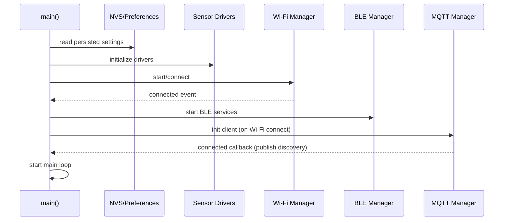

# Architecture Overview

This document describes the overall software structure, runtime flow, and integration points for the ESP32 12V Battery Monitor firmware.

**Repository Layout**

- **Root:** project configuration and top-level docs (`platformio.ini`, `README.md`).
- **src/**: firmware source.
  - `main.cpp`: application entry point (initialization, main loop).
  - `app_config.h` / `app_config.cpp`: compile- and runtime configuration constants and intervals.
  - `telemetry_payload.h` / `telemetry_payload.cpp`: builds JSON telemetry payloads and helpers for formatting values (e.g. `ah_left`).
  - `secret.h`, `secrets.example.h`: build-time secrets and example template.
  - `battery/`:
    - `ocv_estimator.*`: open-circuit voltage -> SOC estimation logic.
    - `state_detector.*`: mode detection (active, parked/idle, alternator detection, deep sleep triggers).
  - `comms/`:
    - `ble_mgr.*`: BLE peripheral, characteristics, BLE command parsing and enqueuing.
    - `mqtt_mgr.*`: MQTT client, topics, discovery payloads, retained telemetry publishing.
    - `wifi_mgr.*`: Wi‑Fi connection management and event hooks.
    - `debug_publisher.h`: optional debug output helper.
  - `learner/`:
    - `battery_config.*`: stores learned parameters (capacity etc.).
    - `rint_learner.*`: routines to learn internal resistance (Rint) over time.
  - `power/`:
    - `sleep_mgr.h`: deep-sleep management and wake scheduling.
  - `sensor/`:
    - `ina226.*`: current/voltage sensor driver.
    - `hall_sensor.*`: analog hall-current sensor handling and calibration.
    - `ds18b20.*`: temperature sensor driver.

**High-level Runtime Flow**

- Startup
  - `main.cpp` calls platform init, config load, NVS/Preferences restore, sensor drivers init, and starts Wi‑Fi/BLE stacks.
- Main loop (periodic cycle)
  - Read sensors (INA226, analog hall sensor, DS18B20).
  - Update estimators: coulomb counter, `ocv_estimator`, `rint_learner` when conditions allow.
  - Detect operating mode with `state_detector` (Active, Parked-Idle, Alternator on).
  - Build telemetry payload using `telemetry_payload.*` and publish via `mqtt_mgr` and BLE notifications as configured.
  - Persist changed runtime settings (e.g., learned capacity, Rint baseline) to NVS via Preferences.
  - Enter deep sleep when `sleep_mgr` decides to conserve power (Parked-Idle long dwell).

**Key Components & Responsibilities**

- `ocv_estimator`: converts resting battery voltage to SOC using the OCV curve. Used to correct long-term drift in coulomb counting.
- Coulomb counting: runtime integration of current samples to track Ah used/remaining. `battery_capacity_Ah` from config or learned values provides scaling.
- `rint_learner`: measures internal resistance under controlled conditions (low current, stable temperature) and updates `Rint` and `Rint25` baselines.
- `state_detector`: uses voltage, current, and timing to determine alternator/charging state and to throttle telemetry cadence.
- `telemetry_payload`: central place to format JSON telemetry. Includes fields:
  - `mode`, `voltage_V`, `current_A`, `temp_C`, `soc_pct`, `soh_pct`, **`ah_left`**, `Rint_mOhm`, `Rint25_mOhm`, `RintBaseline_mOhm`, `alternator_on`, `rest_s`, `lowCurrentAccum_s`, `up_ms`, `hasRint`, `hasRint25`.
- `mqtt_mgr`: connects to broker, publishes Home Assistant discovery messages (retained), and publishes telemetry to `MQTT_TOPIC` (telemetry JSON retained or non-retained depending on message type).
- `ble_mgr`: exposes runtime values and a small command API. Commands are enqueued and executed in the main loop to avoid blocking BLE tasks. Commands include `SET_CAP`, `SET_BASE`, `CLEAR`, and `RESET` variants (case-insensitive parsing).

**Telemetry & Integration**

- Telemetry JSON example (as used in the README):

```json
{
  "mode": "active",
  "voltage_V": 12.65,
  "current_A": 1.20,
  "temp_C": 25.3,
  "soc_pct": 85.0,
  "soh_pct": 97.5,
  "ah_left": 12.34,
  "Rint_mOhm": 10.5,
  "Rint25_mOhm": 10.2,
  "RintBaseline_mOhm": 10.0,
  "alternator_on": true,
  "rest_s": 0,
  "lowCurrentAccum_s": 0,
  "up_ms": 123456,
  "hasRint": true,
  "hasRint25": true
}
```

- Home Assistant
  - `mqtt_mgr` publishes `homeassistant/sensor/<device>_<sensor>/config` discovery payloads (retained) so HA can auto-create sensors.
  - `ah_left` is published formatted to two decimals for display.

**Configuration & Persistence**

- Build-time config: `app_config.h` contains compile-time defaults (e.g., `BATTERY_CAPACITY_AH`, timing constants).
- Runtime overrides: BLE commands and learned parameters are saved to NVS (Preferences keys like `battery_capacity_Ah`, `rintBase_mR`). On startup these are read if present.

**Safety & Operational Notes**

- Rint learning and SOC correction happen only under safe conditions (low current, stable voltage/temperature) to avoid spurious measurements.
- BLE command execution is enqueued and processed in the main loop to avoid concurrency issues with the BLE stack.

**Build & Deploy**

- Standard PlatformIO flow: `pio run --target upload` or configure OTA envs (`espota`) for network updates. See `platformio.ini` and `README.md` for OTA details.

**Extending the System**

- New sensors: add driver under `src/sensor` and expose readings in `telemetry_payload`.
- New telemetry fields: update `telemetry_payload` and Home Assistant discovery payloads in `mqtt_mgr`.
- Alternative persistence/backends: replace NVS helpers in one place to add SPIFFS/SD support.

**References**

- See `src/main.cpp` for application entry and loop.
- See `src/telemetry_payload.cpp` for JSON serialization and `ah_left` formatting.
- See `src/comms/ble_mgr.cpp` and `src/comms/mqtt_mgr.cpp` for runtime integrations.

---


## Sequence Diagrams

Below are compact Mermaid sequence diagrams for the startup flow and the telemetry publish flow.

### Startup Flow



### Telemetry Publish Flow

```mermaid
sequenceDiagram
  participant Loop as Main Loop
  participant Sensors as Sensor Drivers
  participant Est as Estimators (SOC/Rint)
  participant Payload as telemetry_payload
  participant MQTT as MQTT Manager
  participant BLE as BLE Manager
  participant NVS as NVS/Preferences

  Loop->>Sensors: sample voltage/current/temp
  Sensors-->>Loop: readings
  Loop->>Est: update SOC, SOH, Ah left, Rint
  Est-->>Loop: updated metrics
  Loop->>Payload: build telemetry JSON
  Payload-->>Loop: JSON payload
  Loop->>MQTT: publish telemetry (retain as configured)
  Loop->>BLE: notify subscribers
  Loop->>NVS: persist learned params if changed
```


### Visual Architecture Diagram

Below is a simple architecture diagram showing the main modules and their relationships. Open `docs/architecture.svg` in any browser or image viewer to export PNG/SVG as needed.


